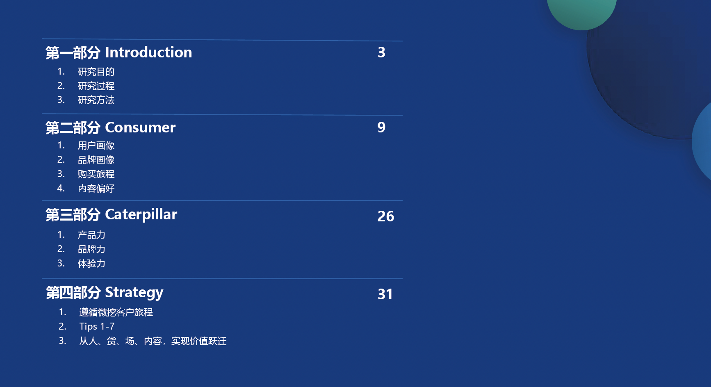
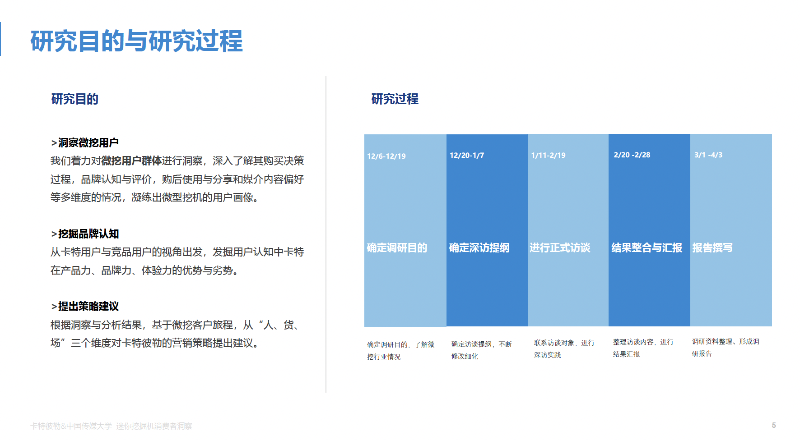
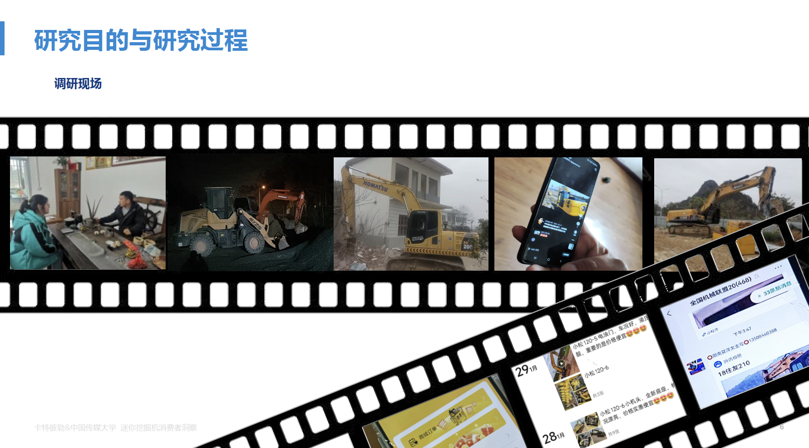
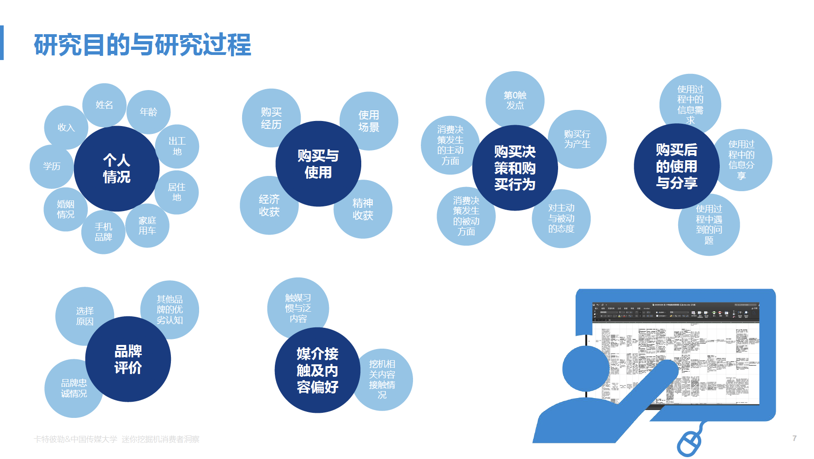
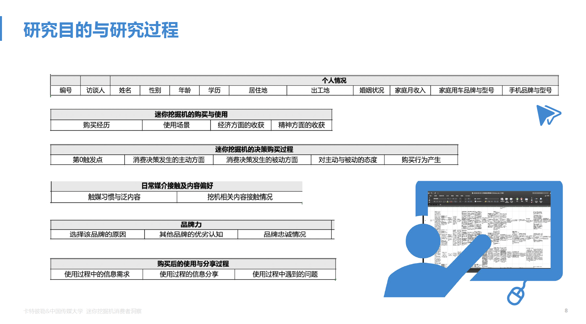
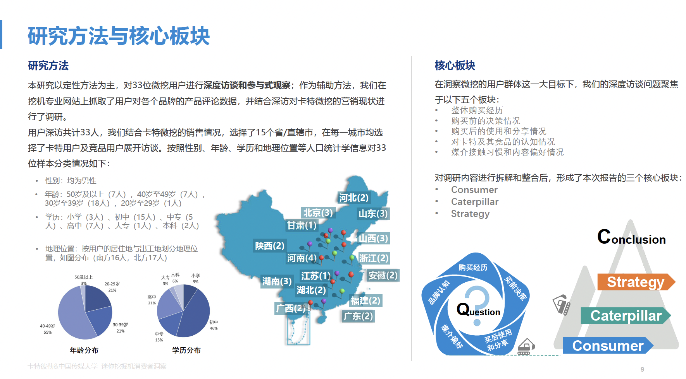
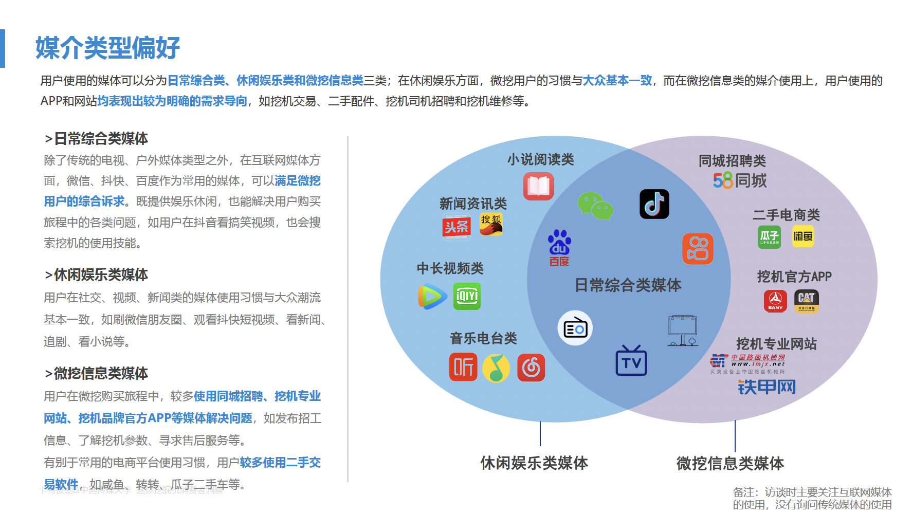
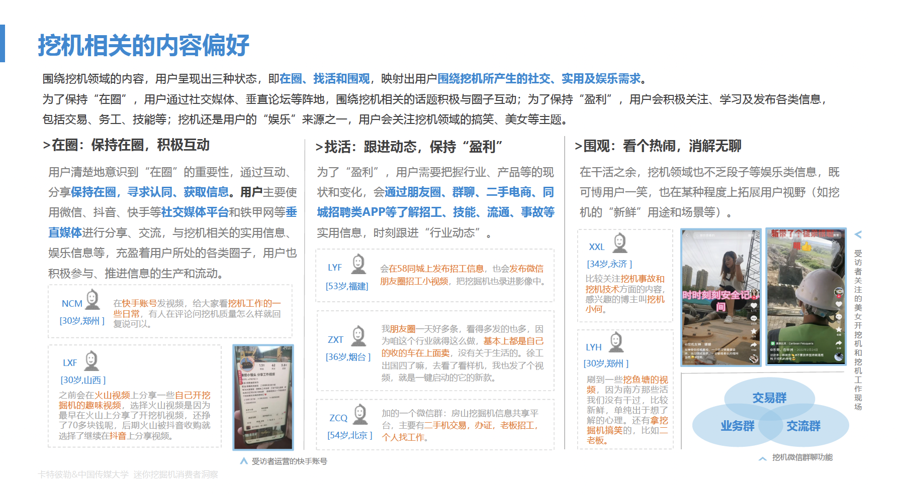
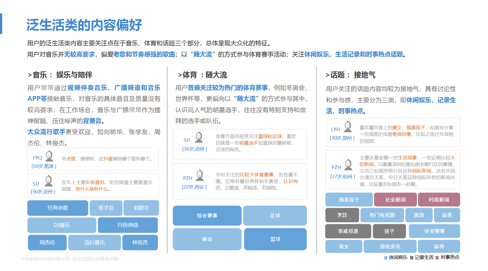

## 我的工作
调研过程中，负责安徽地区的用户深度访谈；报告产出过程，主要负责整体导言和消费者媒介偏好部分。

## PPT摘要
  
  
  
  
  
  
  
  
  
    
  
  

[//]: # ([![The template is mobile first with a responsive design to ensure that your site looks stunning on every device.]&#40;https://raw.githubusercontent.com/wowchemy/wowchemy-hugo-modules/main/starters/academic/preview.png&#41;]&#40;https://hugoblox.com&#41;)

