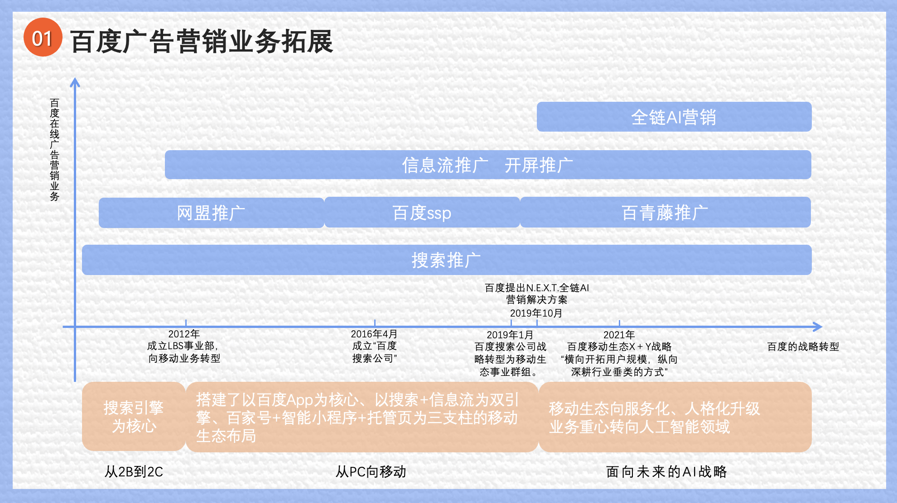
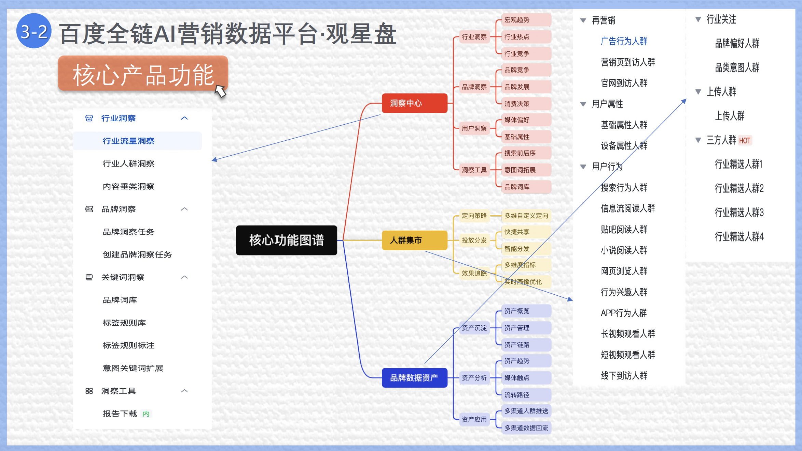

## 我的工作
  梳理百度平台的数据/流量来源；
  整理总结百度营销平台的大数据产品和工具的功能和使用。

## PPT摘要
  
  
  
  
  

[//]: # ([![The template is mobile first with a responsive design to ensure that your site looks stunning on every device.]&#40;https://raw.githubusercontent.com/wowchemy/wowchemy-hugo-modules/main/starters/academic/preview.png&#41;]&#40;https://hugoblox.com&#41;)

