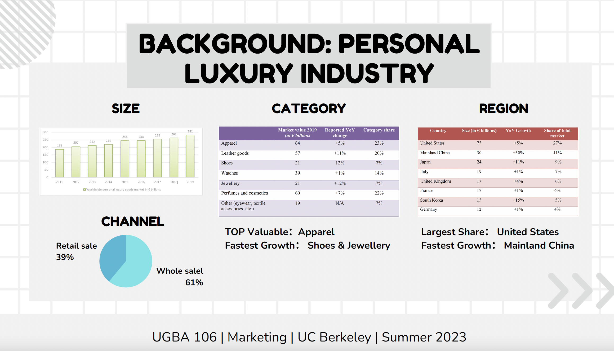
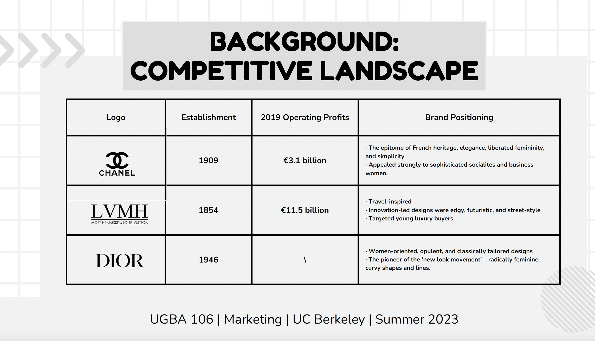
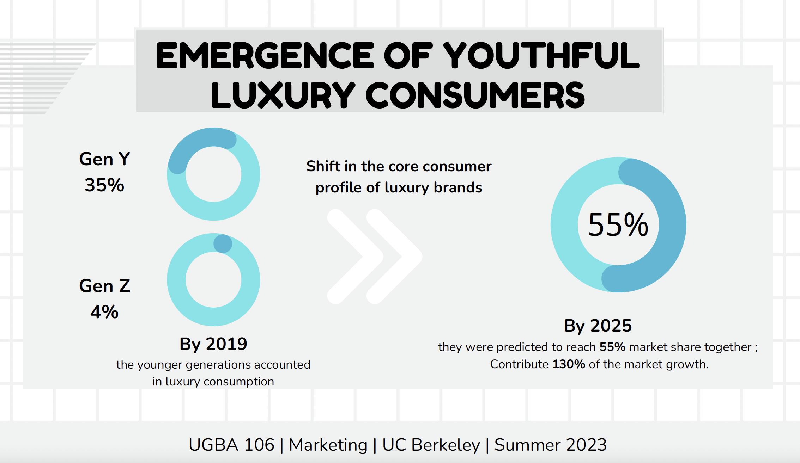
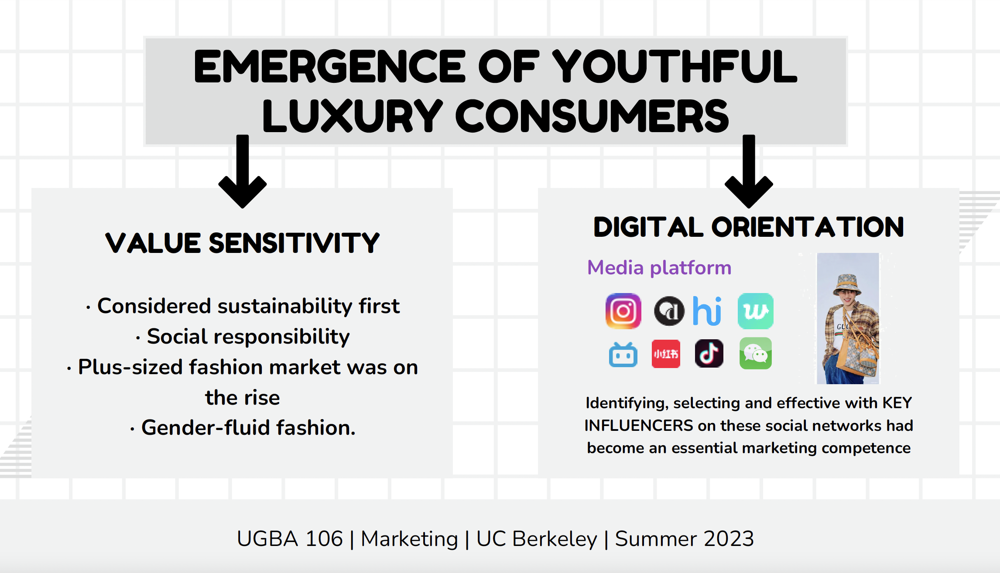

---
title: Case Study:Gucci 
summary: 奢侈品品牌Gucci的市场营销策略分析
date: 2023-07-28

authors:
  - admin

tags:
  - PPT
  - 营销
  - 品牌
  - 团队成果
---

## 我的工作
   对Gucci所在的行业市场背景（产业情况和竞争对手）进行分析，总结品牌的消费者画像（人口统计学特征、价值观念和媒介偏好）

## PPT摘要
  
  
  
  
  

[//]: # ([![The template is mobile first with a responsive design to ensure that your site looks stunning on every device.]&#40;https://raw.githubusercontent.com/wowchemy/wowchemy-hugo-modules/main/starters/academic/preview.png&#41;]&#40;https://hugoblox.com&#41;)
