## 我的工作
  对网易云音乐、QQ音乐这两款主流音乐平台的产品功能、产品体验、商业模式、营销推广四个方面展开。对每一个产品的功能进行细细拆解，产品体验部分进行了用户访谈和评论爬取。最后进行对比和总结。

## PPT摘要
  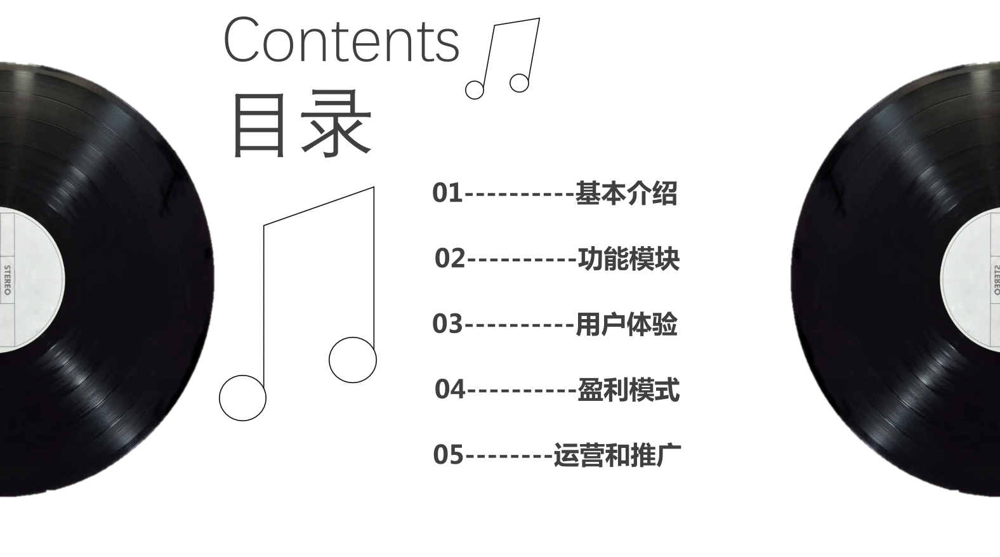
  
  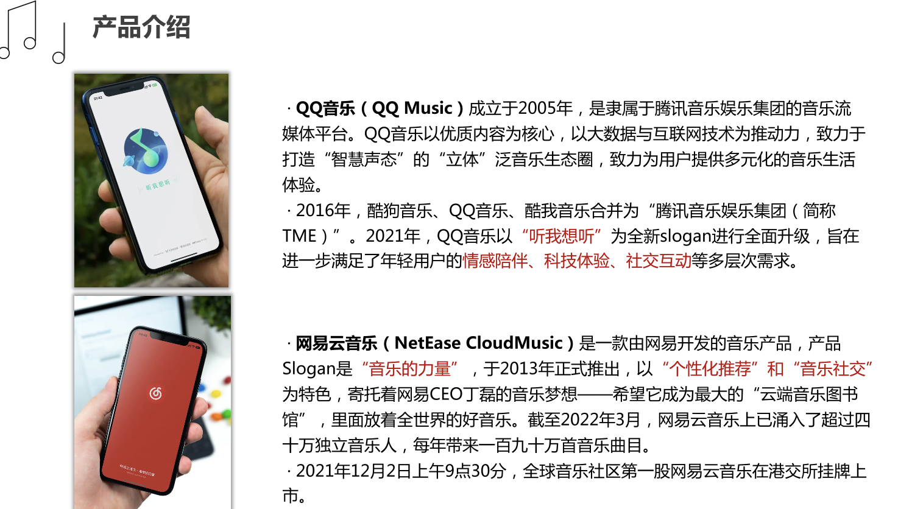
  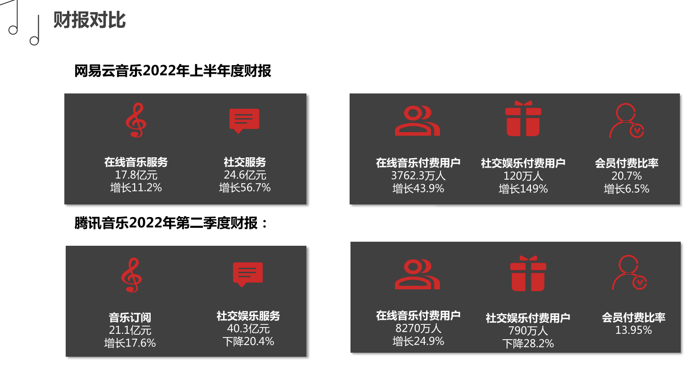
  
  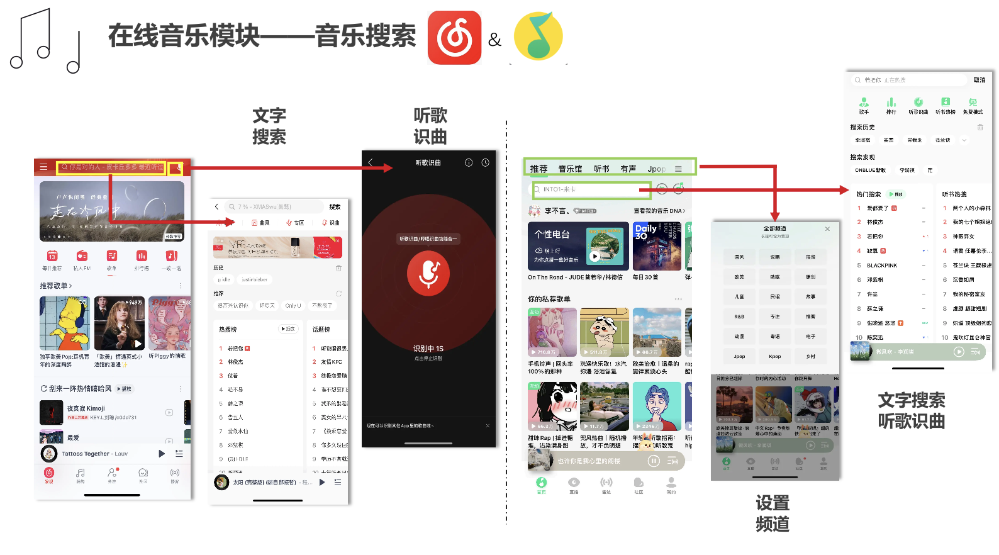
  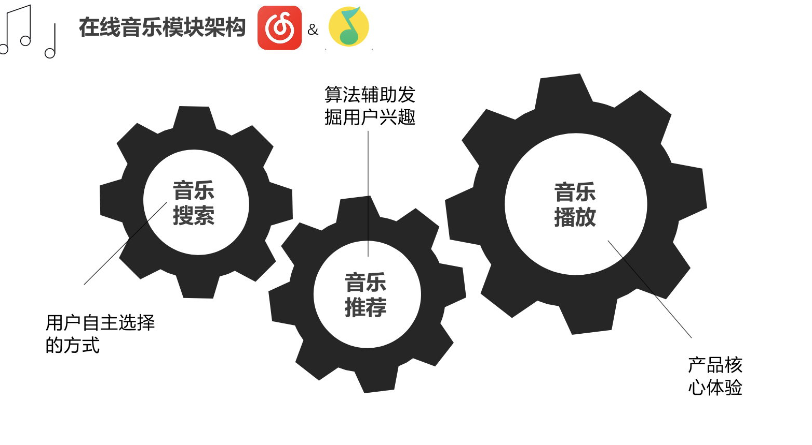
  
  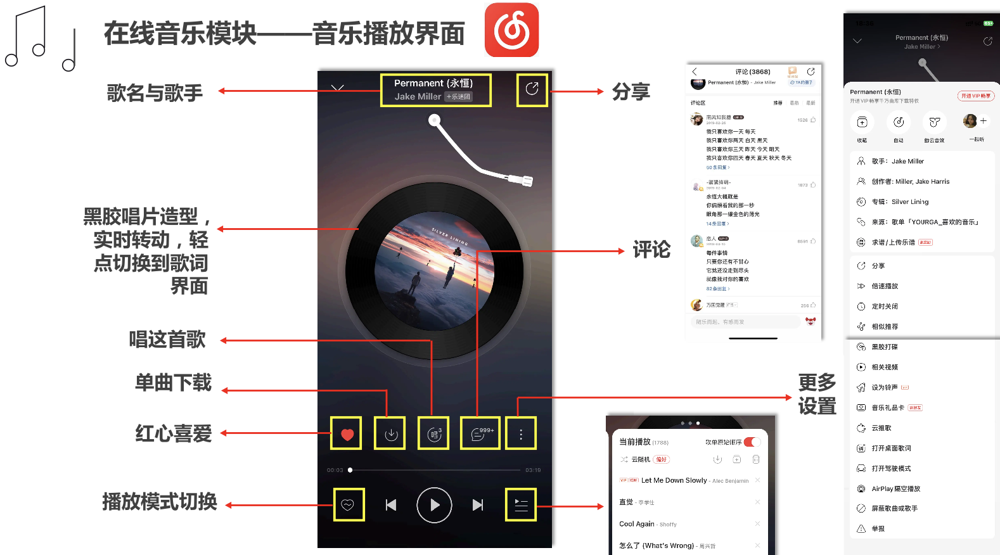
  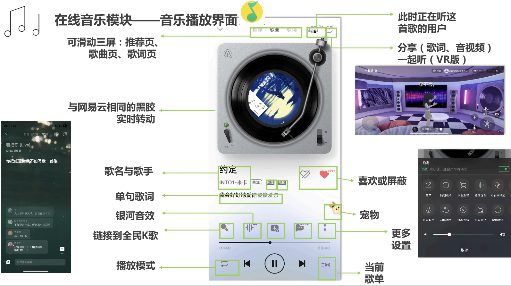
  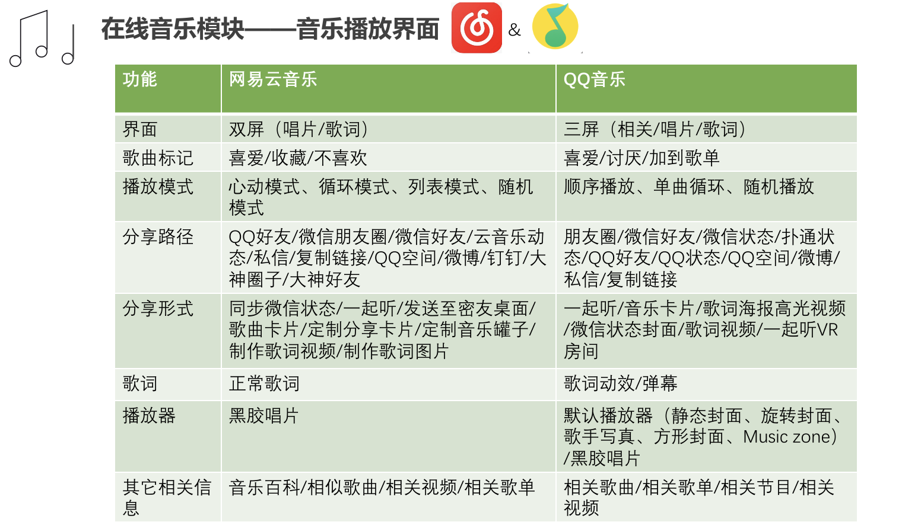
  
  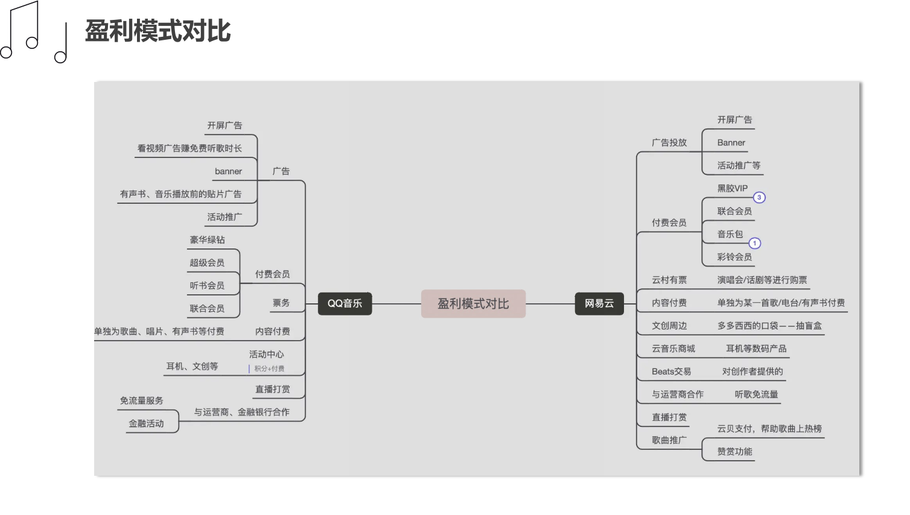
  
  
  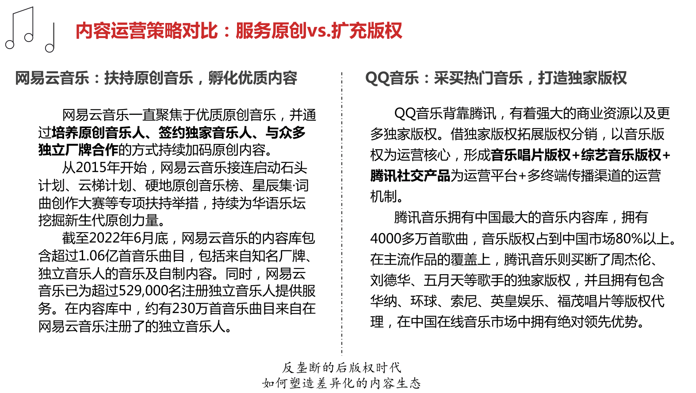
  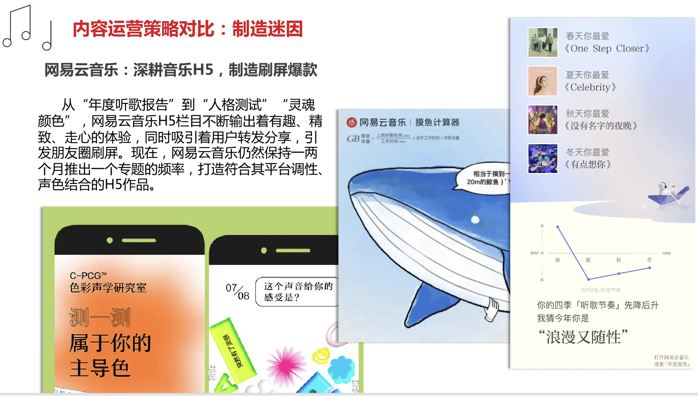
  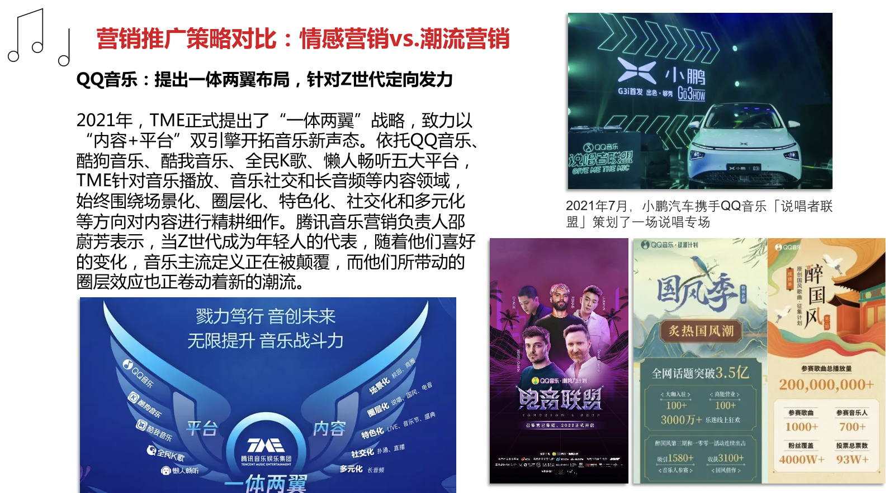
  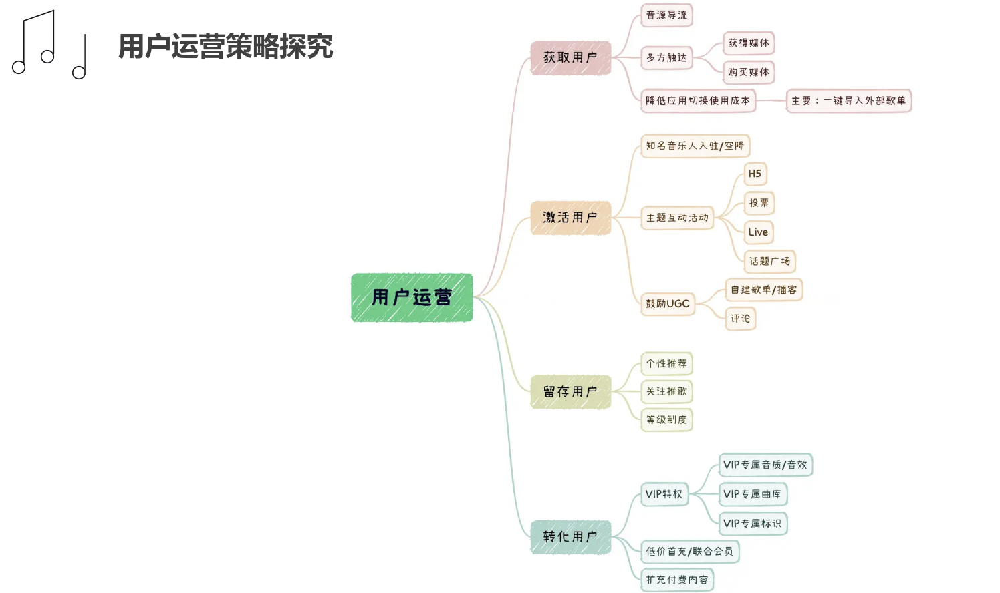
  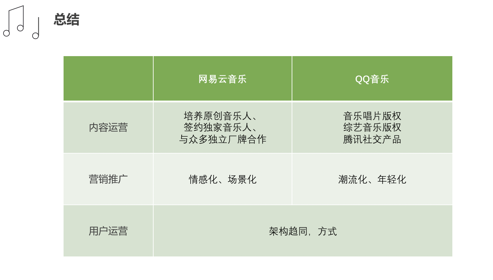
  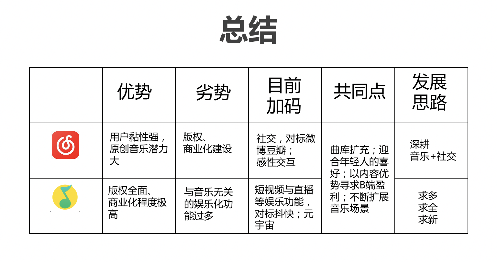
  
## 全文链接
  查看全文，请进入：https://kdocs.cn/l/coQfla3wllFu 

