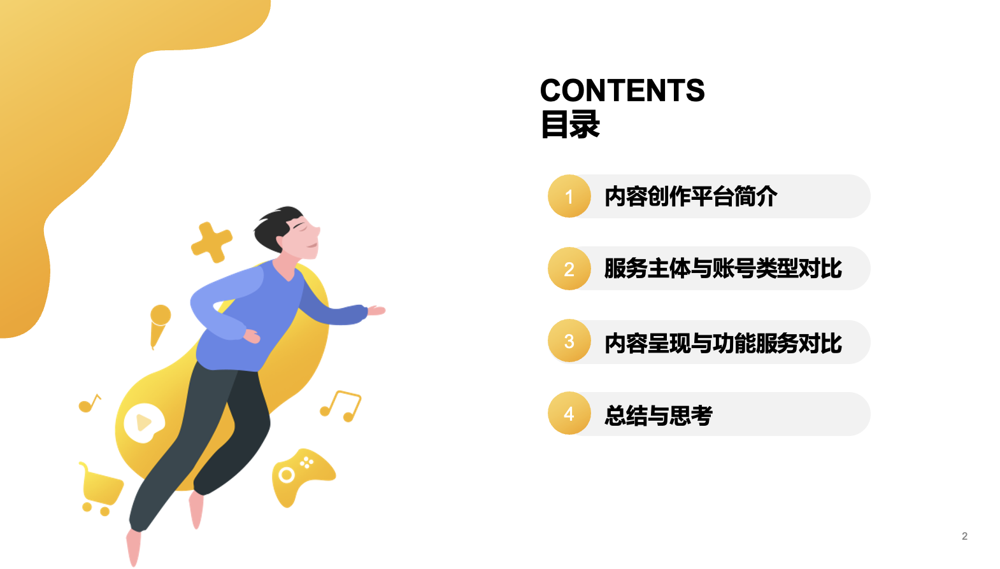
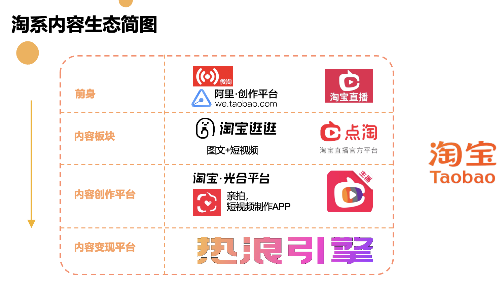
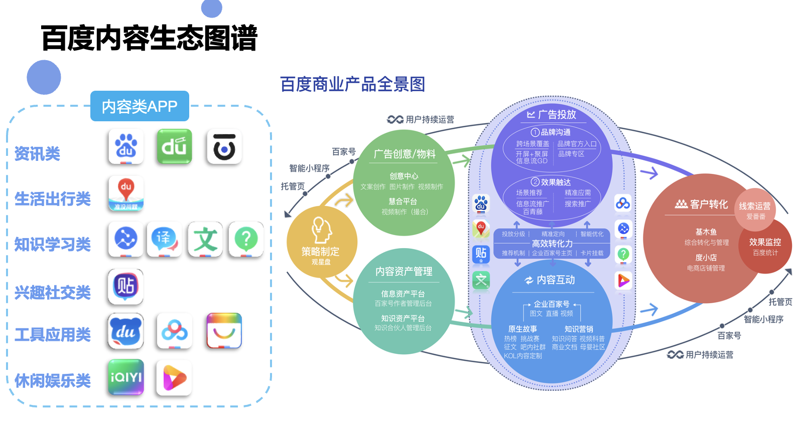
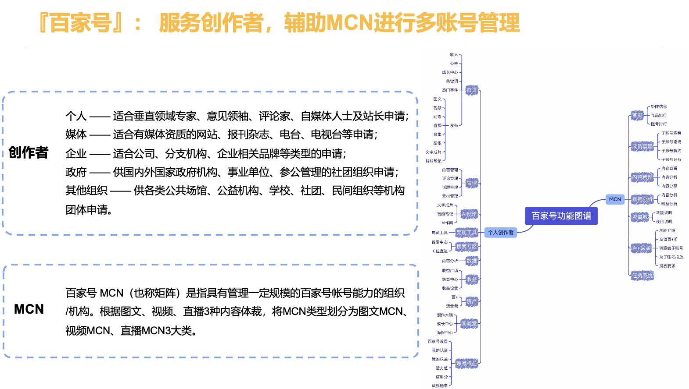
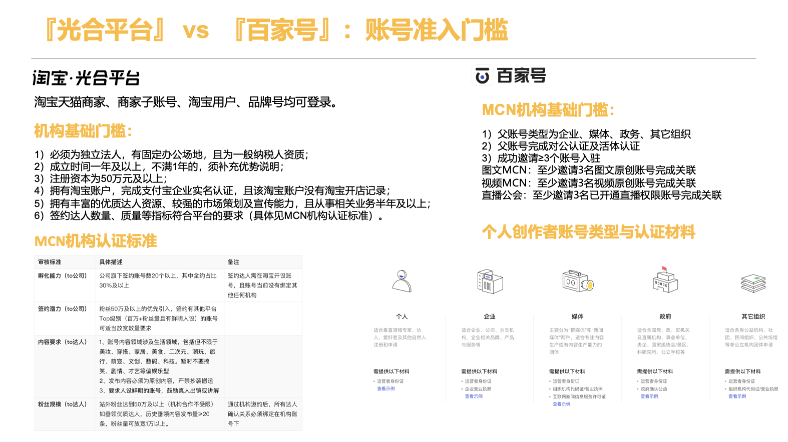
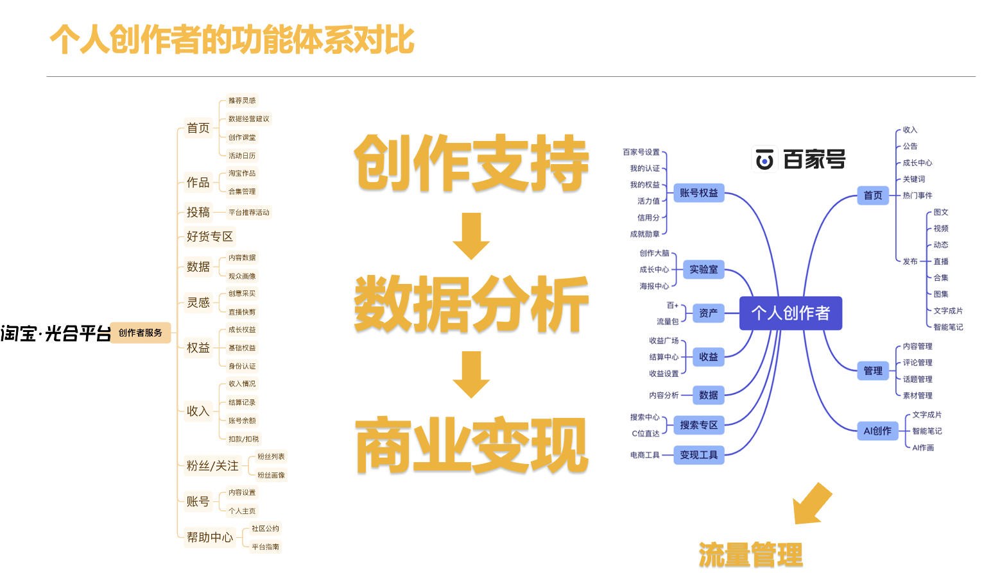
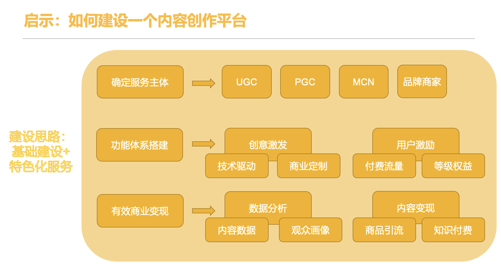

## 我的工作
  对淘宝光合平台和百家号服务于内容创作者的两大平台进行对比分析，从服务主体、账号类型、内容呈现、功能服务四个维度进行深入分析，最后总结出一个内容创作平台应该具备的要点，并对光合平台和百家号的不同的发展趋势进行思考。

## PPT摘要
  
  
  
  
  
  
  
## 全文链接
查看全文：请进入 https://kdocs.cn/l/cqmh4IVH3v1Z

